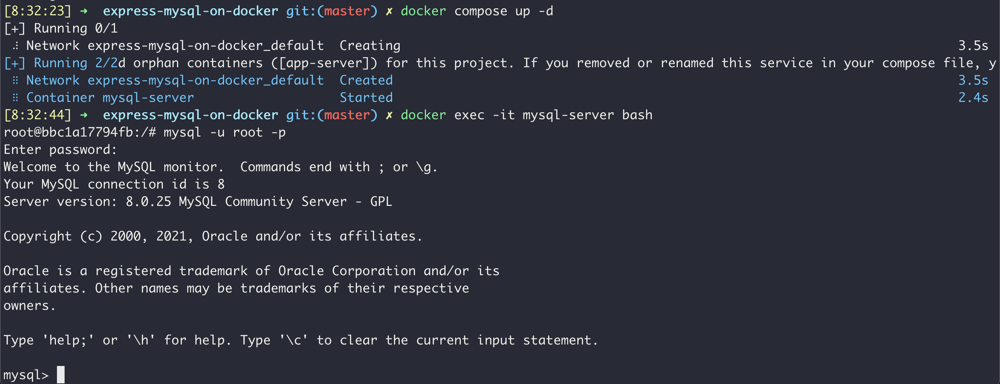

# 도커에 mysql 서버 올리기

상태: 완료
생성일: 2021년 6월 12일 오전 9:31
완료일: 2021년 6월 13일
태그: 백엔드

</br>

# 목표

- docker 위에서 mysql 서버를 올려보기
- `dockerfile`을 안쓰고 `docker-compose.yml`만으로 올리기

</br>

# 해야 할 것

- [x]  `docker-compose.yml` 를 작성하기

</br>

# 코드 작성

### `docker-compose.yml` 를 작성하기

```docker
version: "3.9"
services:
  db:
    image: 
      mysql
    environment:
      MYSQL_ROOT_PASSWORD: "1111"
    ports:
      - "5000:3306"
```

`version: "3.9"` 

yml 파일 포맷 버전

`services: db`

컨테이너에 올릴 서비스 이름. 아무렇게나 지어도 됨.

`image: mysql`

컨테이너에 올릴 도커 이미지. 제대로 적기만 하면 dockerhub에서 알아서 다운받아진다.

`ports: - "5000:3306"`

"{호스트OS가 여는 포트}:{컨테이너가 여는 포트}". mysql 은 기본 포트가 3306이니까 내부 포트는 3306으로 고정. 외부 포트는 하고싶은대로 하면 됨.

`envirionment: MYSQL_ROOT_PASSWORD: "1111"`

환경변수 (호스트OS가 있어야 작동하는거 아닌가?)

</br>

# **실행 확인**



컨테이너를 끄고싶으면 `docker compose down` 을 쓰자. 

</br>

# 후기

mysql은 dockerfile 안쓰고 해서 그런지 docker-compose를 공부하기 좋다.

</br>

# QA

- mysql 단독으로 쓰는데 포트가 왜 필요하나? 싶은데... 포트 지정을 안하면 에러가 뜬다. 왜일까?


포트 지정을 안해주니 네트워크를 못찾는데... 근데 저 daemon은 뭐하는 놈이지?

</br>

# Ref

[DockerCompose로 개발 환경 구성하기](http://raccoonyy.github.io/docker-usages-for-dev-environment-setup/) - "db 서비스와 달리 앱 서비스는 도커 이미지를 빌드할 일이 잦기 때문에, 특정 이미지 대신 build 옵션을 추가합니다."

</br>